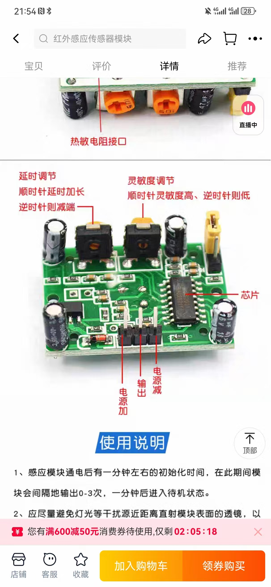

# pi5-hs-sr501--tools

本仓库提供树莓派 5 (Pi5) 搭配 HS-SR501 红外人体感应传感器的基本示例代码。



## 硬件连接
1. **VCC** 接树莓派 5 的 `5V` 供电引脚。
2. **GND** 接树莓派 5 的 `GND` 引脚。
3. **OUT** 接树莓派 5 的 `BCM 18` (物理引脚 12)，或根据需要选择其他 GPIO 引脚。

## 调节灵敏度
HS-SR501 模块板上带有用于设定探测范围和触发间隔的两个电位器。
标记为 `SENS` 的旋钮用于改变红外感应距离：
顺时针旋转时灵敏度增加，感应范围变大；逆时针则降低灵敏度。
另一枚 `TIME` 旋钮控制从检测到动作到再次可触发之间的延迟，
顺时针旋转延迟时间变长，逆时针缩短时间。

### SENS 与 TIME 调校要点

旋钮可视作在调节“门卫的警觉程度”与“报警后的冷却时间”。

#### SENS：调节警觉程度

- `SENS` 实际上控制比较器阈值。顺时针阈值降低、灵敏度提升，能感应更远但更易
 受环境干扰；逆时针阈值升高，可减少误报，但过低时可能漏报远处或轻微的动作。

| 旋钮位置 | 阈值 | 检测距离 | 常见表现 | 精度特点 |
|---------|-----|---------|---------|---------|
| 顺时针极限 | 最低阈值 | 最远 | 远处轻微动作即触发 | 捕捉率高但误报增多 |
| 中间位置 | 中等阈值 | 中等 | 日常走动可靠触发 | 捕捉率和误报较平衡 |
| 逆时针极限 | 最高阈值 | 最近 | 只有非常靠近、明显的动作才触发 | 误报极少但容易漏报 |

- 室内小空间（玄关、书房等）可适当降低灵敏度，避免频繁误触；
- 开阔走廊、车库或庭院可提高灵敏度，以扩大监测范围。

#### TIME：冷却/锁存时间

- `TIME` 决定触发后 OUT 引脚保持高电平的时长。该期间模块不会再次触发。
- 时间越长，报警次数减少；时间越短，可更快响应下一次动作。

| TIME 位置 | 锁存时间 | 应用场景示例 | 特点 |
|-----------|---------|-------------|-----|
| 顺时针最高档 | 约 5 分钟 | 长时间有人活动但无需重复提醒 | 减少重复触发 |
| 中间位置 | 约 30 秒～1 分钟 | 门口或客厅有人来回走动 | 平衡检测频率与干扰 |
| 逆时针最低档 | 约 2～3 秒 | 对快速移动非常敏感的场合 | 捕捉高频动作 |

建议从两枚旋钮的中间位置开始，根据误报或漏报情况逐步微调，并记录测试结
果以找到最合适的组合。

## 运行示例
```bash
pip install lgpio gpiozero
```

```bash
python3 main.py [--pin GPIO编号]
```

其中 `--pin` 用于指定传感器 OUT 引脚连接的 BCM 编号，默认值为 `18`。脚本会在终端打印“Motion detected!”和“No motion.”，分别表示检测到动作或恢复为无人状态。
